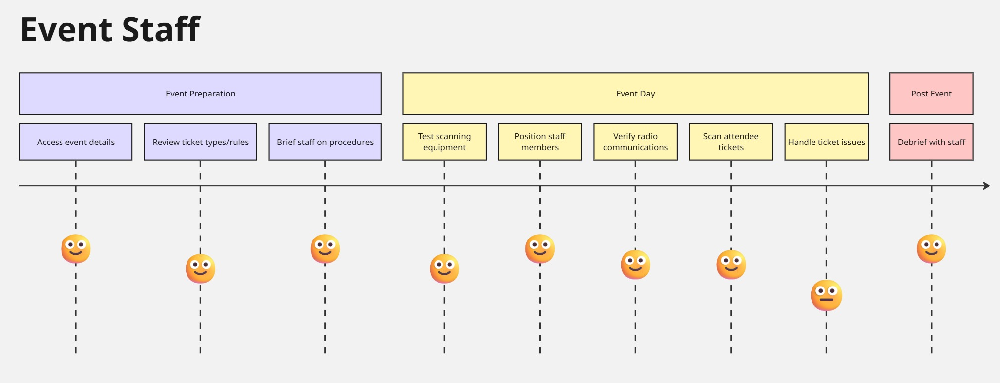
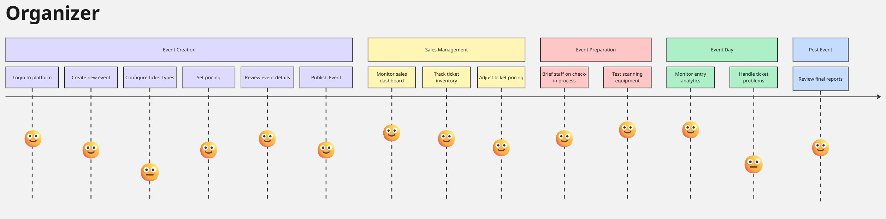
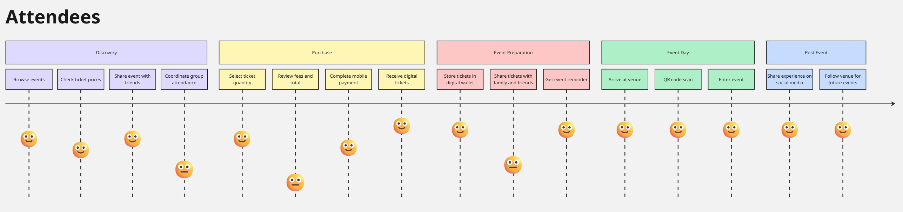
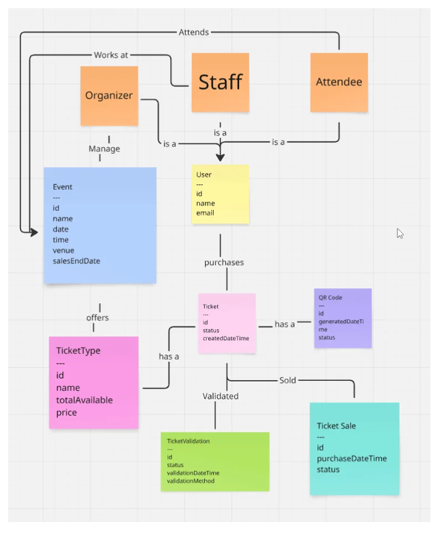
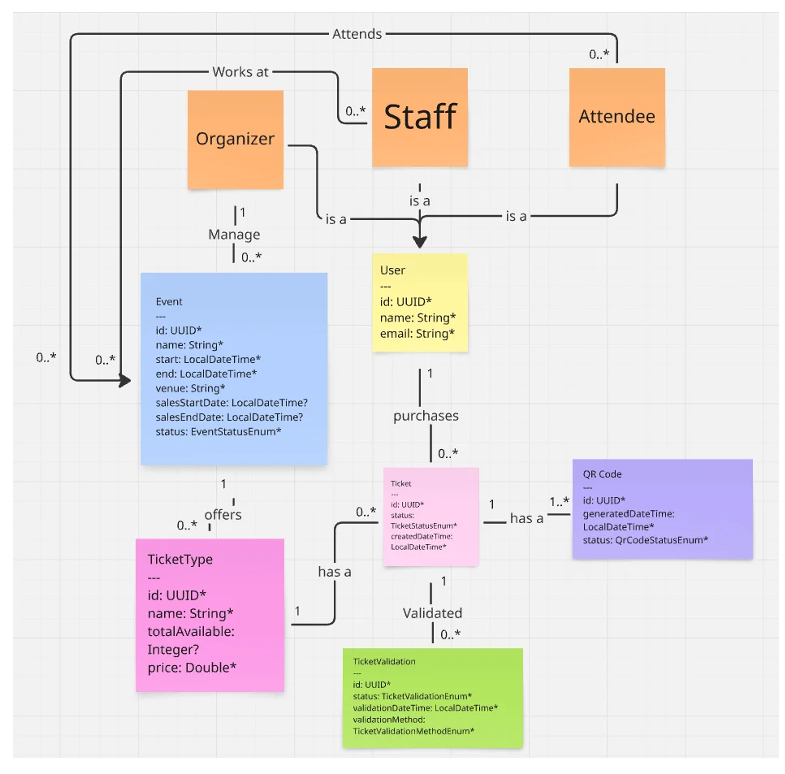
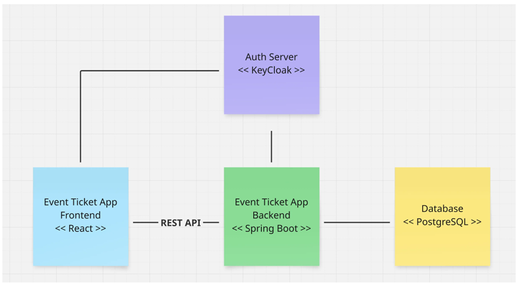

# Project Overview

Let's break down the main components of our event ticketing system.
Our system needs to handle event creation, ticket sales, sales monitoring, and ticket
validation -- the complete event management lifecycle.
The platform will serve three types of users:
1. Event organizers
2. Event attendees
3. Event staff

Each user type has their own needs, and way of using the system

# User Story Analysis
## Event Creation Requirements
### Create Event

As an Event Organizer
I want to create and configure a new event with details like date, venue and ticket types
So that I can start selling tickets to attendees

**Acceptance Criteria**
* Organizer can input event name, date, time and venue
* Organizer can set multiple ticket types with different prices
* Organizer can specify total available tickets per type
* Event appears on the platform after creation

### Purchase Ticket Event

As an event goer
I want to purchase the correct ticket for an event
So that I can attend and experience the event

**Acceptance Criteria**
* Event goer can search for events
* Event goer can browse and select different ticket types available each event
* Event goer can purchase their chosen ticket type

### Manage Ticket Sales

As an event organizer
I want to monitor and manage ticket sales
So that I can track revenue and attendance

**Acceptance Criteria**
* Dashboard displays sales metrics
* Organizer can view purchaser details
* System prevents overselling of tickets
* Sales automatically stop at specified end date

### Validate Tickets 

As an event staff member
I want to scan attendee QR codes at entry
So that I can verify ticket authenticity

**Acceptance Criteria**
* Staff can scan QR codes using mobile device
* System displays ticket validity status instantly
* System prevents duplicate ticket use
* Staff can manually input ticket numbers if QR scan fails

## Technical Implementation Notes

We'll create RESTful endpoints for each major function
* Event management APIs 
* Ticket purchase APIs 
* Sales monitoring APIs 
* Ticket validation APIs

# User Journey

A user journey is the step-by-step path a user takes to accomplish a goal in your system.







* Note: The faces indicate the emotions experienced at each stage in the journey
* Gives designers more insight into areas of friction and pain points for users. Thus influencing the design of the system. 

# Summary
## User Persona Summary
* Explored user personas representing organizers, attendees and staff
* These user personas will influence how the system is designed

## User Journey 
* Explored user journeys for organizers, attendees and staff
* The user journeys offer insight into how different users may interact with the system
* The user journeys will influence how the system is designed and implemented

# Domain Modelling
In this module, we'll create a class diagram that represents the ticket platform's domain, giving us the information we need to design our application's REST API



## Event
The Event class represents a planned gathering with properties like:
* id - A unique identifier
* name - The event's title
* date and time - When the event occurs
* venue - Where the event takes place
* salesEndDate - When ticket sales stop

## Ticket Type
The TicketType class defines different categories of tickets available for an event:
* id - A unique identifier
* name - The type of ticket (e.g., "VIP", "Standard")
* price - Cost of the ticket
* totalAvailable - Maximum number that can be sold

## Ticket
The Ticket represents an individual purchase:
* id - A unique identifier
* status - The status of the ticket, perhaps it's been cancelled?
* createdDateTime - The date and time the ticket was created

## QR Code
The QrCode represents the code used to represent the ticket's information, present on each
ticket:
* id - A unique identifier
* generatedDateTime - The time and date the QR code was generated
* status - The status of the QR code -- is it still valid?
## User
The User class represents people interacting with our system, where Organizer, Attendee
and Staff are different types of User:
* id - A unique identifier
* name - Person's name
* email - Contact information

## Ticket Validation
Finally, TicketValidation is for event entry management:
* id - A unique identifier
* validationTime - When validation occurred
* validationMethod - How it was validated
* status - Result of validation

We'll evolve this domain diagram further as our design progresses.

# Domain Cardinality & Data Types



* Note: Attributes with asterisks are mandatory, attributes with question marks are optional

# Architecture Design



Based on the functionality we've captured, we'll need a few components:
* Spring Boot app -- The backend of our application, exposing a REST API
* React App -- The frontend of our application, which calls the REST API
* Keycloak -- Our auth server, handling authentication and authorization

**Keycloak** = Identity & Access Management (IAM)
Handles authentication, user identity, and roles so your app doesn’t manage passwords.

Keycloak performs:

Authentication
* verifies login credentials
* handles MFA & security

User management
* stores users & passwords
* manages roles & permissions
* uses its own database

Token issuance
* issues secure JWT access tokens after login

Login Flow:
1. User logs in via Keycloak
2. Keycloak verifies credentials
3. Keycloak returns access token to frontend
4. Frontend sends token to backend
5. Backend verifies token & processes request

Access token contains user ID, username/email, roles & permissions, expiration time, signature (security) which allows the backend to decide what information it can respond with.

# Project Setup
1. Create a new Spring Boot project
2. Explore the project structure
3. Set up and connect to PostgreSQL
4. Set up and connect to Keycloak
5. Configure MapStruct for object mapping

## Create Spring Boot Project
### Dependencies
#### Web Dependencies
For building our REST API endpoints we'll use Spring Web. We selected this over
WebFlux for a simpler development experience, and it provides good performance for our
needs.

### Security Dependencies
We'll need Spring Security for securing our application and OAuth2 Resource Server for
integration with Keycloak

**Spring Security** is a framework that adds authentication (who you are) and authorization (what you can access) to a Spring Boot application. When you include spring-boot-starter-security, it automatically protects endpoints, supports login/logout, encrypts passwords, manages sessions, and prevents common attacks. 
* For example, an endpoint like GET /api/books can be restricted to ADMIN only, hence normal users cannot access the endpoint

**OAuth2 Resource Server** is responsible for processing access tokens and deciding whether a request is allowed. 

When a user logs in through an identity provider like Keycloak, their credentials are verified and an access token (usually a JWT) is issued to the client. The client then includes this token in requests to your Spring Boot API. The OAuth2 Resource Server component in Spring Security validates the token (checking its signature, issuer, and expiry) to confirm the user is authenticated, while Spring Security uses the roles or scopes inside the token to decide whether the user is allowed to access specific endpoints.

### Database Dependencies
We choose Spring Data JPA for database interactions using Java objects. We'll want the
PostgreSQL Driver for our production database and H2 Database for running isolated
tests.

### Development Tools:
Let's also select Lombok as it reduces boilerplate code through annotations

# Running PostgreSQL
## Setup PostgreSQL with Docker
Docker makes running PostgreSQL simple and consistent across different development
environments. Let's create a docker-compose.yml file to define our database setup
```
services:
 db:
   image: postgres:latest
   ports:
     - "5432:5432"
   restart: always
   environment:
     POSTGRES_PASSWORD: changemeinprod!
 adminer:
   image: adminer:latest
   restart: always
   ports:
     - 8888:8080
```
This configuration sets up two services:
* A PostgreSQL database running on port 5432
* Adminer, a web-based database management tool, running on port 8888

To run the services: 

`docker-compose up`

## Configure Spring Boot Database Connection
Our application needs to know how to connect to PostgreSQL. We'll configure this in
application.properties:

```
#Database Connection

spring.datasource.url=jdbc:postgresql://localhost:5432/postgres
spring.datasource.username=postgres
spring.datasource.password=changemeinprod!

#JPA Configuration

spring.jpa.hibernate.ddl-auto=update
spring.jpa.show-sql=true
spring.jpa.properties.hibernate.format_sql=true
spring.jpa.properties.hibernate.dialect=org.hibernate.dialect.PostgreSQLDialect
```

The database connection properties tell Spring Boot:
* Where to find the database (localhost:5432)
* Which database to use (postgres)
* The login credentials

The JPA configuration enables:
* Automatically create and update the schema based on Spring Data JPA Entities created in the program. E.g. adding a new field to an entity will be updated
* SQL logging for development debugging
* PostgreSQL-specific SQL dialect for optimal database interaction

# Running Keycloak
## Setup Keycloak with Docker Compose
Docker Compose makes it easy to run Keycloak alongside our other services. Let's add
the Keycloak service to our existing docker-compose.yml:

```
keycloak:
    image: quay.io/keycloak/keycloak:latest
    ports:
        - "9090:8080"

    environment:
        KEYCLOAK_ADMIN: admin
        KEYCLOAK_ADMIN_PASSWORD: admin
    volumes:
        - keycloak-data:/opt/keycloak/data
    command:
        - start-dev- --db=dev-file

volumes:
    keycloak-data:
        driver: local
```

The configuration maps Keycloak's default port 8080 to 9090 on our host machine to avoid
conflicts with our Spring Boot application.
We're using volumes to persist Keycloak's data between container restarts, unlike our
PostgreSQL setup where we prefer a fresh start each time.

## Configuring Keycloak
Once Keycloak is running, we need to set up three main components:
1. Create a realm named event-ticket-platform
2. Set up a client for our frontend application
3. Create a test user to represent an organizer

For the client configuration:
* Client ID: event-ticket-platform-app
* Client authentication: Off (for public access)
* Valid redirect URIs: http://localhost:5173
* Post logout redirect URIs: http://localhost:5173

## Connecting Spring Boot to Keycloak
To connect our Spring Boot application to Keycloak, we add this property to
application.properties:

```
spring.security.oauth2.resourceserver.jwt.issuer-uri=http://localhost:9090/realms/event-ticket-platform
```

This tells Spring Security to validate JWTs against our Keycloak instance.

# Configuring MapStruct
We'll integrate Mapstruct with our Event Ticket Platform to efficiently handle
object mapping between different layers of our application, while ensuring it works
smoothly with Project Lombok. 
* Specifically, we'll map between DTOs and Entities and vice versa

# User Provisioning
In this module, we'll implement automatic user creation when users first log in to our
ticketing platform.

This functionality ensures that user data is properly stored and managed in our database,
which is essential for tracking ticket purchases and user activity.

## Module Structure
Create a custom filter for user provisioning
Configure Spring to use the filter
Enable JPA audit field annotations

## Learning Objectives
1. Implement a filter to create new users in the database
2. Configure Spring to use the user provisioning filter
3. Enable the created and last updated annotations used in the entity classes

## User Provisioning Filter
In this lesson, we'll implement a filter that creates new users in our database when they
first log in, ensuring every authenticated user has a corresponding User in the database.

**Motivation**

When users signs up and logs in through Keycloak, their details are stored and authenticated through
Keycloak's personal database. Hence, when Keycloak forwards the JWT token to our backend,
we only know that the user is valid, and is authenticated BUT there is no existing row containing that 
user in our database.

**Solution**

A user provisioning filter intercepts incoming requests after authentication to check if a
user exists in our database and creates them if they don't.
This filter is valuable because it automatically creates user records in our database when
users first authenticate through Keycloak, without requiring additional API endpoints or
manual intervention.

**Layers**
```
HTTP Request
↓
Spring Security authenticates JWT
↓
UserProvisioningFilter
↓
Controller
```

# Spring Security Configuration
We'll configure Spring Security to work with the User Provisioning Filter

```declarative
@Configuration
public class SecurityConfig {
   @Bean
   public SecurityFilterChain filterChain(
           HttpSecurity http,
           UserProvisioningFilter userProvisioningFilter) throws Exception {
       http
               .authorizeHttpRequests(authorize ->
                       // All requests must be authenticated
                       authorize.anyRequest().authenticated())
               .csrf(csrf -> csrf.disable())
               .sessionManagement(session ->
                       session.sessionCreationPolicy(SessionCreationPolicy.STATELESS))
               .oauth2ResourceServer(oauth2 ->
                       oauth2.jwt(
                               Customizer.withDefaults()
                       ))
               .addFilterAfter(userProvisioningFilter, BearerTokenAuthenticationFilter.class);
       return http.build();
   }
}
```

Recall Spring Security is responsible for ensuring that only valid users of the appropriate role
is allowed to proceed with the HTTP request.

**SecurityFilterChain** does this by running a **chain of filters** for every HTTP request.
The method creates and registers the security filter chain bean that Spring will use automatically at runtime.

In the method, our filter chain involves
1. Ensuring all users are authenticated 
2. Disabling csrf because authentication is not cookie based (protects against csrf attacks)
3. Creating stateless sessions
4. Validating JWT token
5. Adding the UserProvisioningFilter to run afterwards

**HttpSecurity** object is a builder used to configure/design how Spring Security protects HTTP requests
* HttpSecurity = designing the security process for airport security
* SecurityFilterChain = actual checkpoints passengers pass through

**Stateless/Stateful Sessions**

In a **stateful session**, when a user logs in the server creates a unique session stored in server memory 
and sends a cookie containing the session ID to the browser. Each HTTP request includes this cookie, allowing 
the server to look up the session and remember the user. Sessions typically expire after a period of 
inactivity or after a fixed time, requiring the user to log in again.

In a **stateless** JWT-based system, no session is stored on the server. Instead, after login the identity provider
(e.g. Keycloak) issues a JWT token to the client. The client includes this token in every HTTP request, and the server 
verifies it to authenticate the user, remembering their session. Because the token contains the authentication data, the server does not 
need to store session state. The user does not stay logged in when the access token expires.
They only stay logged in if a refresh token (or active SSO session) allows the client to obtain a new access token.

# JWT
JWT is a JSON Web Token which is a compact, secure string that proves a user is authenticated 
and tells a backend who they are and what they’re allowed to do.

1. User logs in via Keycloak
2. Server issues a JWT access token to the client
3. Client (frontend) stores it in memory
4. Client sents JWT with every request it makes to the backend
5. Backend verifies token to permit or deny access

A JWT contains three parts:
```
HEADER.PAYLOAD.SIGNATURE
```

**Header**
* Describes how the token is signed

**Payload**
* Contains **claims** (information about the user like name, email, role etc)

**Signature**
* Ensures the token has not been tampered with

# Global Exception Handler
It centralizes how errors are caught, logged, and returned to the client.

Instead of each controller handling errors individually, this class ensures 
consistent error responses across the entire application.

@RestControllerAdvice tells Spring:

“If any controller throws an exception, check here for how to handle it.”

So whenever an exception is thrown in any controller or service, Spring 
looks for a matching @ExceptionHandler method in this class.

**What @Slf4j does**
* This Lombok annotation creates a logger:
```
log.error("message", ex);
```
* This logs errors to the console/log files — essential for debugging.

All handlers return:
```
ResponseEntity<ErrorDto>
```
This means the client receives JSON like:

```
{
"error": "User not found"
}
```
This keeps error responses clean and consistent.
